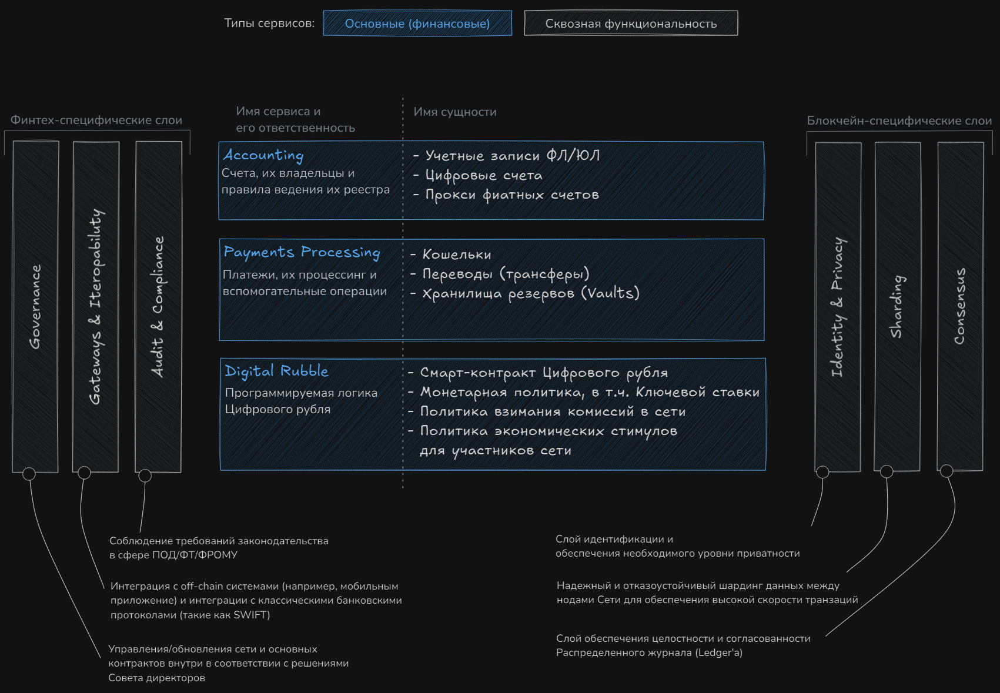
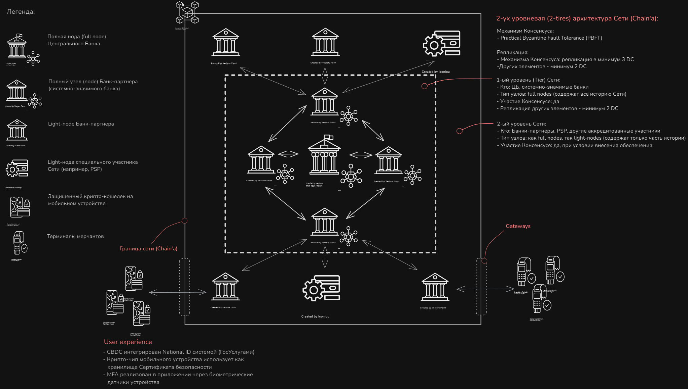

# CBDC System Design

Project 'Digital Rubble Platform' of the [ARCHI.Tech 2025 Hackathon](https://architechhack.vtb.ru/track2).

## Conceptual Level

## Topology

## Additional

- [Cases as UML Diagrams](seq-diagrams/)
- [Data Model](system-design/data_model.svg)
